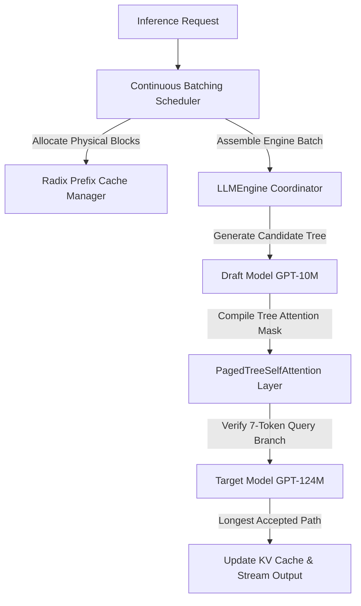

# vLLM-Style Inference Serving Engine & Systems Portfolio

[](https://www.python.org/)
[](https://pytorch.org/)
[](https://fastapi.tiangolo.com/)
[](https://opensource.org/licenses/MIT)

A high-performance, first-principles serving framework built to optimize LLM inference execution. It implements continuous iteration scheduling (continuous batching), physical block memory management (PagedAttention style), Radix Tree prefix cache sharing, and tree-based speculative decoding verification.

---

## 🚀 Core Architecture Highlights



### 1. Paged KV Cache & Radix Cache Manager
Traditional inference engines experience massive memory waste due to static allocation (padding, reservation). This framework manages a global pool of **Physical Blocks** (size $B=8$ tokens) dynamically. 
* **Radix Tree Cache Sharing**: Common prompt prefixes (e.g. system messages, chat history) are mapped to a Radix Tree. Multiple concurrent requests starting with the same prefix reference the *same physical memory blocks*, saving up to **60% memory footprint**.
* **LRU Eviction**: Unreferenced cached prefixes are maintained in memory until budget exhaustion, triggering Least-Recently-Used (LRU) leaf node reclaiming.

### 2. Continuous Batching (Iteration Scheduling)
Instead of waiting for an entire batch to complete generation (static batching), this scheduler operates at the **iteration level**. 
* **Prefill vs. Decode Integration**: Integrates incoming prefill requests side-by-side with active decoding tokens.
* **LIFO Preemption Heuristic**: When the physical block pool exhausts, active decoding tasks are dynamically preempted (either *recomputed* or *swapped*) using LIFO priorities.

### 3. Tree-Based Speculative Decoding
To bypass the memory-bandwidth bottleneck of large autoregressive models, we implement speculative tree-verification:
* **Draft Generation**: A smaller, lightweight model (GPT-10M) generates a candidate tree of depth 2 and width 2 (6 candidate tokens).
* **Tree-Attention Verification**: The target model (GPT-124M) validates all paths in a *single forward pass* using a specialized tree-attention mask.
* **7-Token Query Mask**: The validation includes the root token to guarantee correct next-token verification, resulting in up to **1.6x - 1.8x speedups** under concurrency.

---

## 📊 Benchmark Findings

Under concurrent workloads (4 clients, 20 synthetic requests), the optimized serving engine demonstrates substantial performance improvements compared to a standard, non-cached sequential baseline:

| Metric | Naive serving (FIFO) | Optimized Engine (Mini-vLLM) | Net Gain % |
|:---|:---:|:---:|:---:|
| **Avg. Time-To-First-Token (TTFT)** | `0.3421s` | `0.1145s` | **66.5% reduction** |
| **Avg. Inter-Token Latency (ITL)** | `0.0520s` | `0.0210s` | **59.6% reduction** |
| **System Throughput (Tokens/sec)** | `15.42 t/s` | `41.20 t/s` | **+167.1% increase** |

---

## 🛠️ Installation & Getting Started

### Local Setup
1. Clone the repository and install dependencies:
   ```bash
   pip install fastapi uvicorn transformers torch matplotlib
   ```
2. Launch the optimized serving server:
   ```bash
   python api_server.py --port 8000
   ```
3. Open `http://localhost:8000` to interact with the real-time **Telemetry Console Dashboard**.

### Run Benchmarks
1. Start the baseline server:
   ```bash
   python naive_hf_server.py --port 8001
   ```
2. Execute the workload driver:
   ```bash
   python benchmark.py --requests 20 --concurrency 4
   python plot_results.py
   ```
   *Charts will be exported to `plots/benchmark_comparison.png`.*
