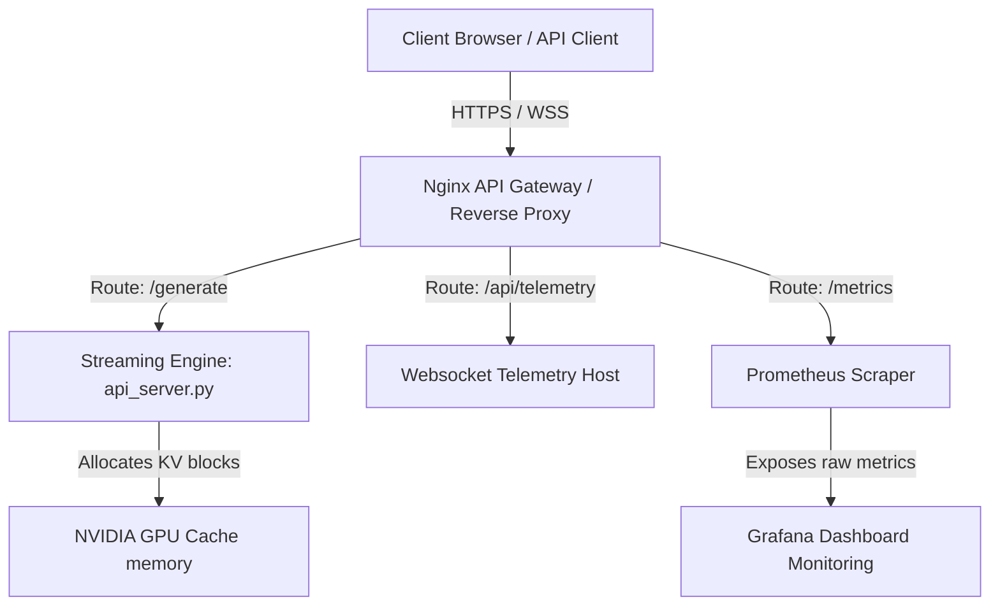

# Production Deployment Playbook: Mini vLLM Serving Engine

This guide details the blueprint and operational playbooks to deploy the custom serving engine in a secure, production-grade cloud environment.

---

## 1. Cloud Architecture Overview

In a typical production setup, requests are routed from clients through an API Gateway/Load Balancer to the serving containers running on GPU-equipped virtual machines.



---

## 2. Setting Up GPU Support inside Docker

To serve LLM requests at production scale, you should run on GPU hardware. The engine automatically leverages CUDA if it is available. 

### Prerequisites
On a GPU cloud VM (e.g., AWS `g4dn.xlarge`, RunPod, or Lambda Labs):
1. Install **NVIDIA GPU Drivers**.
2. Install **Docker** and **Docker Compose**.
3. Install the **NVIDIA Container Toolkit** (which allows Docker containers to access host GPU resources).

### Install NVIDIA Container Toolkit (Ubuntu/Debian)
```bash
# Add package repositories
curl -fsSL https://nvidia.github.io/libnvidia-container/gpgkey | sudo gpg --dearmor -o /usr/share/keyrings/nvidia-container-toolkit-keyring.gpg \
  && curl -s -L https://nvidia.github.io/libnvidia-container/stable/deb/nvidia-container-toolkit.list | \
    sed 's#deb https://#deb [signed-by=/usr/share/keyrings/nvidia-container-toolkit-keyring.gpg] https://#g' | \
    sudo tee /etc/nginx/sites-available/nvidia-container-toolkit.list

# Install toolkit
sudo apt-get update && sudo apt-get install -y nvidia-container-toolkit

# Configure Docker daemon to use NVIDIA runtime
sudo nvidia-container-toolkit q --setup
sudo systemctl restart docker
```

### Docker Compose GPU Configuration
Modify the `serving-engine` section in `docker-compose.yml` to request GPU hardware:

```yaml
  serving-engine:
    build: .
    container_name: vllm-serving-engine
    deploy:
      resources:
        reservations:
          devices:
            - driver: nvidia
              count: all
              capabilities: [gpu]
    ports:
      - "8000:8000"
    environment:
      - PYTHONUNBUFFERED=1
    volumes:
      - hf_cache:/root/.cache/huggingface
    restart: unless-stopped
```

---

## 3. SSL/TLS Termination using Let's Encrypt (Certbot)

To secure the endpoints in production with HTTPS, we configure Nginx to read SSL/TLS certificates and automate certificate renewal using Certbot.

### Step 1: Install Certbot on the Host Machine
```bash
sudo apt-get update
sudo apt-get install -y certbot python3-certbot-nginx
```

### Step 2: Request Certificate
Temporarily stop Nginx container if it binds to port 80:
```bash
docker-compose stop nginx-gateway
sudo certbot certonly --standalone -d yourdomain.com
```

### Step 3: Update Nginx to Terminates SSL
Edit your `nginx.conf` mapping port `443` and cert directories:

```nginx
server {
    listen 80;
    server_name yourdomain.com;
    return 301 https://$host$request_uri; # Redirect HTTP to HTTPS
}

server {
    listen 443 ssl;
    server_name yourdomain.com;

    ssl_certificate /etc/letsencrypt/live/yourdomain.com/fullchain.pem;
    ssl_certificate_key /etc/letsencrypt/live/yourdomain.com/privkey.pem;
    
    # Secure SSL Protocols
    ssl_protocols TLSv1.2 TLSv1.3;
    ssl_ciphers HIGH:!aNULL:!MD5;

    # Routes (Same proxy_pass settings as port 80)...
}
```

Mount Let's Encrypt certificates to the Nginx service in `docker-compose.yml`:
```yaml
  nginx-gateway:
    image: nginx:alpine
    ports:
      - "80:80"
      - "443:443"
    volumes:
      - ./nginx.conf:/etc/nginx/nginx.conf:ro
      - /etc/letsencrypt:/etc/letsencrypt:ro
```

---

## 4. Production Launch Checklist

1. **Verify GPU Binding**:
   Run `nvidia-smi` inside the serving container to confirm CUDA access:
   ```bash
   docker-compose exec serving-engine python -c "import torch; print(torch.cuda.is_available())"
   ```
2. **Warm up Cache**:
   During initial VM spin-up, pre-download and cache weights (e.g., GPT-2/Qwen) so client requests don't hit downloading latencies.
3. **Verify SSE Buffering is Disabled**:
   Verify that headers of `/generate` show:
   - `Content-Type: text/event-stream`
   - `X-Accel-Buffering: no` (or Nginx proxy buffering disabled)
